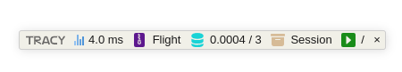
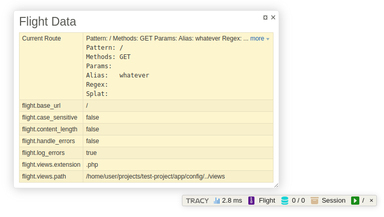
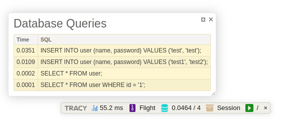
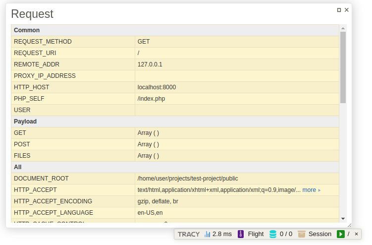

Tracy Flight Panel Extensions
------

This is a set of extensions to make working with Flight a little richer.

- Flight - Analyze all Flight variables.
- Database - Analyze all queries that have run on the page (if you correctly initiate the database connection)
- Request - Analyze all `$_SERVER` variables and examine all global payloads (`$_GET`, `$_POST`, `$_FILES`)
- Session - Analyze all `$_SESSION` variables if sessions are active.

This is the Panel



And each panel displays very helpful information about your application!





Installation
-------
Run `composer require flightphp/tracy-extensions --dev` and you're on your way!

Configuration
-------
There is very little configuration you need to do to get this started. You will need to initiate the Tracy debugger prior to using this [https://tracy.nette.org/en/guide](https://tracy.nette.org/en/guide):

```php
<?php

use Tracy\Debugger;
use flight\debug\tracy\TracyExtensionLoader;

// bootstrap code
require __DIR__ . '/vendor/autoload.php';

Debugger::enable();
// You may need to specify your environment with Debugger::enable(Debugger::DEVELOPMENT)

// if you use database connections in your app, there is a 
// required PDO wrapper to use ONLY IN DEVELOPMENT (not production please!)
// It has the same parameters as a regular PDO connection
$pdo = new PdoQueryCapture('sqlite:test.db', 'user', 'pass');
// or if you attach this to the Flight framework
Flight::register('db', PdoQueryCapture::class, ['sqlite:test.db', 'user', 'pass']);
// now whenever you make a query it will capture the time, query, and parameters

// This connects the dots
if(Debugger::$showBar === true) {
	new TracyExtensionLoader(Flight::app());
}

// more code

Flight::start();
```